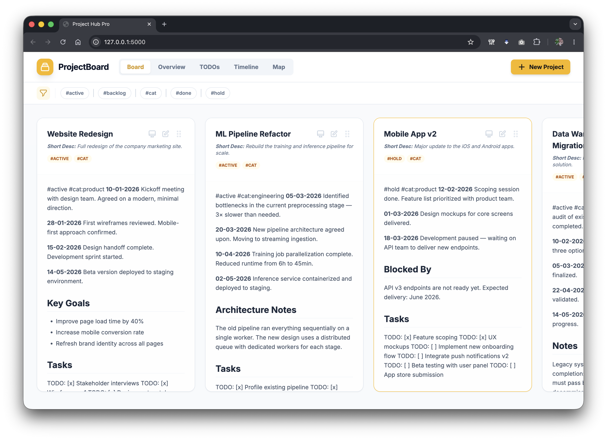
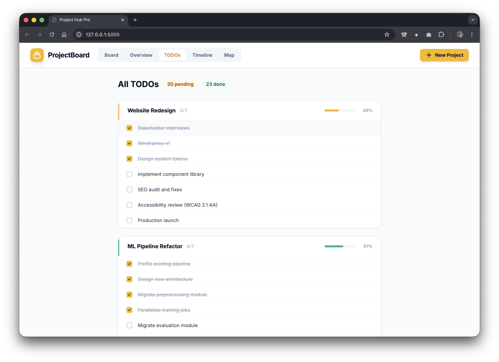
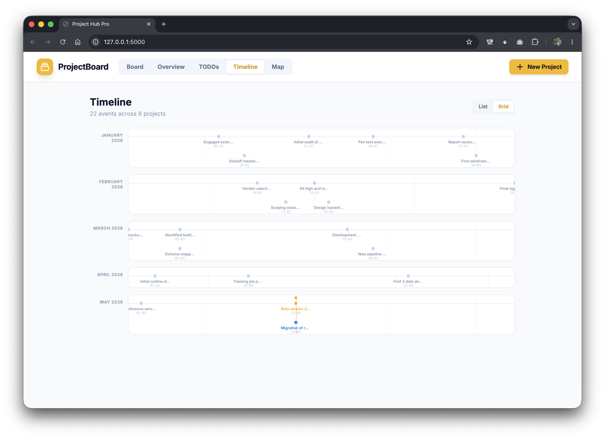
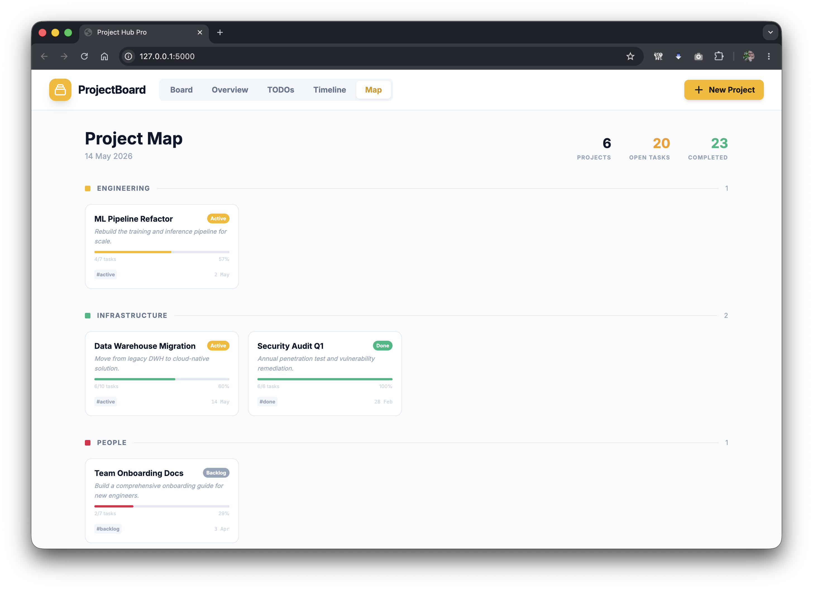
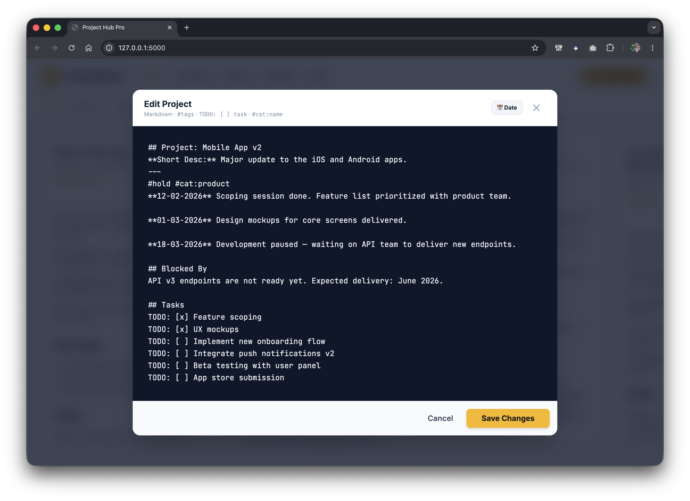

# Project Hub Pro

A lightweight personal project management and note-taking app. All your data lives in a single Markdown file — no database, no cloud sync, no accounts. Just run it locally and open a browser.



---

## Features

- **Board view** — Kanban-style columns, one per project, drag to reorder
- **Overview** — compact table with title, description, tags, and content size
- **TODO Hub** — global task list aggregated from all projects, grouped by project, with live checkboxes
- **Timeline** — two modes: chronological list or horizontal month-grid view of all date markers
- **Map view** — executive dashboard grouped by category, with task progress bars and status badges

---

## Views

### Board
The default view. Each project is a scrollable card showing its full Markdown content. Drag the handle to reorder. Click the edit icon to open the editor, or the screen icon for a clean presentation mode.


### TODOs
Aggregates every `TODO: [ ] task` and `TODO: [x] task` line from all projects into one list, grouped by project. Click a checkbox to toggle it — the change is written back to the Markdown file immediately.



### Timeline
Two display modes toggled by the **List / Grid** button in the top-right corner.

- **List** — chronological feed grouped by month with project pill labels
- **Grid** — each month is a horizontal lane; events are positioned proportionally by day with automatic vertical staggering for nearby dates. A gold marker shows today.



### Map
An at-a-glance portfolio view, grouped by category. Each project card shows its short description, a task completion bar, status badge, tags, and the most recent date mentioned in its notes. Designed to answer *"show me what you're working on"* in one screenshot.



### Editor
A full-screen Markdown editor with a dark code-style textarea. Press **📅 Date** to insert today's date at the cursor in the correct format.



---

## Getting Started

**Requirements:** Python 3.9+, pip

```bash
git clone https://github.com/your-username/project-hub-pro.git
cd project-hub-pro
pip install flask
python app.py
```

Then open [http://127.0.0.1:5000](http://127.0.0.1:5000) in your browser.

A demo `db/projects.md` file is included so you can explore all views immediately. When you're ready to use it for real, just edit that file or start creating projects from the UI.

> **Tip:** Once you start storing real notes, add `db/projects.md` to your `.gitignore` so personal data is never accidentally committed. The line is already there, commented out.

---

## Data Format

Everything is stored in `db/projects.md`. The format is plain Markdown with a few lightweight conventions:

```markdown
## Project: My Project Name
**Short Desc:** One-line summary shown in the Overview and Map views.
---
#tag1 #tag2 #cat:engineering

Your free-form Markdown notes go here.

**14-05-2026** Date markers create Timeline entries.

TODO: [ ] A pending task
TODO: [x] A completed task
```

### Conventions

| Syntax | Purpose |
|---|---|
| `## Project: Name` | Starts a new project |
| `**Short Desc:** …` | Subtitle shown in Overview and Map |
| `#tagname` | Tag — used for filtering in Board/Overview |
| `#cat:name` | Category — groups projects in the Map view |
| `#_hidden` | Tags starting with `_` hide the project from the default view |
| `**dd-mm-yyyy**` | Date marker — appears on the Timeline |
| `TODO: [ ] task` | Open task — appears in the TODO Hub |
| `TODO: [x] task` | Completed task |

### Status badges (Map view)

Add one of these tags to a project to show a coloured status badge:

| Tag | Badge |
|---|---|
| `#active` | Active |
| `#done` | Done |
| `#hold` or `#paused` | Hold |
| `#backlog` | Backlog |

---

## Stack

| Layer | Technology |
|---|---|
| Backend | Python / Flask |
| Frontend | Vanilla JS, Tailwind CSS (CDN), Marked.js, Sortable.js |
| Storage | Single Markdown file |

No build step, no bundler, no database. The entire UI is served as a single HTML template from `app.py`.

---

## License

MIT
